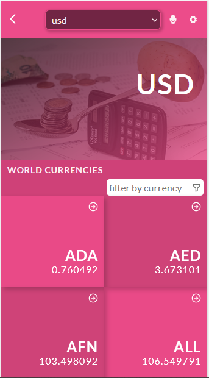
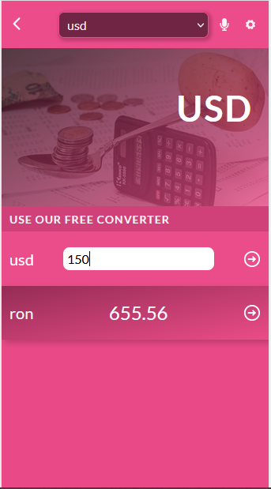

<br />
<p align="center">

  <h3 align="center">Convertir</h3>


  
  

  <p align="center">
    "Convertir" is a Single Page Application that allows you to convert from any currency into over 160 world currencies using current exchange rates.
    <br />
    <a href="#"><strong>Explore the docs 👇🏽</strong></a>
    <br />
    <br />
    <a href="https://www.loom.com/share/e1c531a9c98c48ddacda0ede9fa53416?sharedAppSource=personal_library"> <strong>Video Demo</strong> </a>
    ·
    <a href="https://convertirr.netlify.app/"><strong>Live Demo</strong></a>
    ·
    <a href="https://github.com/codepantha/convertir/issues">Report Bug</a>
    ·
    <a href="https://github.com/codepantha/convertir/issues">Request Feature</a>
  </p>
</p>

<details open="open">
  <summary>Table of Contents</summary>
  <ol>
    <li>
      <a href="#about-the-project">About The Project</a>
      <ul>
        <li><a href="#built-with">Built With</a></li>
      </ul>
    </li>
    <li>
      <a href="#getting-started">Getting Started</a>
      <ul>
        <li><a href="#prerequisites">Prerequisites</a></li>
        <li><a href="#installation">Installation</a></li>
      </ul>
    </li>
    <li><a href="#usage">Usage</a></li>
    <li><a href="#roadmap">Roadmap</a></li>
    <li><a href="#contributing">Contributing</a></li>
    <li><a href="#license">License</a></li>
    <li><a href="#contact">Contact</a></li>
    <li><a href="#acknowledgements">Acknowledgements</a></li>
  </ol>
</details>

## About The Project

"Convertir" is a Single Page Application that allows you to convert from any currency into over 160 world currencies using current exchange rates.

### Built With

- [HTML](https://www.w3schools.com/html/)
- [CSS](https://www.w3schools.com/css/)
- [JS](https://www.javascript.com/)
- [React js](https://www.reactjs.org)
- [Redux](https://react-redux.js.org)

## Authors
👤 **Eze Promisie**

- GitHub: [@Eze Promisie](https://github.com/codepantha)
- Twitter: [@Eze Promisie](https://twitter.com/codepantha)
- LinkedIn: [Eze Promisie](https://www.linkedin.com/in/promise-eze/)

## Getting Started

- You will not need additional instructions on installing Prerequisites.
- In case you have node_modules on your folder Add them to .gitignore file before you a push.

### Prerequisites

- No prerequisites needed for this project.

### Installation


1. Clone the repo
   ```sh
   https://github.com/codepantha/convertir.git
   ```

2. Install NPM packages
   ```sh
   npm install
   ```
3. Run server
   ```sh
   npm start
   ```

## Roadmap

See the [open issues](https://github.com/codepantha/convertir/issues) for a list of proposed features (and known issues).

## Contributing

Contributions are what make the open source community such an amazing place to be learn, inspire, and create. Any contributions you make are **greatly appreciated**.

1. Fork the Project
2. Create your Feature Branch (`git checkout -b feature/NewFeature`)
3. Commit your Changes (`git commit -m 'Add some NewFeature'`)
4. Push to the Branch (`git push origin feature/NewFeature`)
5. Open a Pull Request

## License

License Free.

## ⭐️ Acknowledgments
Original design by [Nelson Sakwa on Behance](https://www.behance.net/sakwadesignstudio)  <br />

The amazing [currency api](https://github.com/fawazahmed0/currency-api) behind this project.
